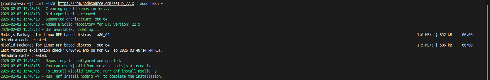
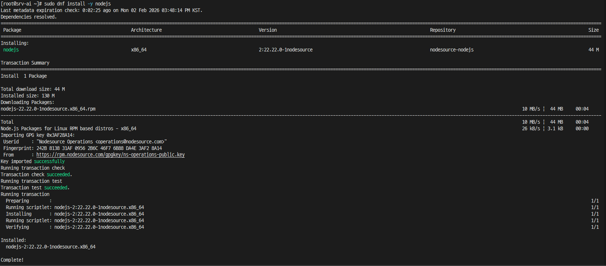

## OpenClaw 설치

이제 본격적으로 OpenClaw를 설치해보자

우선 OpenClaw를 설치하기 위해 필요한 패키지들이 있다.
```bash
dnf install -y git tar gzip dnf-utils policycoreutils-python-utils
dnf groupinstall -y "Development Tools"
dnf install -y cmake gcc-c++ python3
```
그리고 가장 중요한 node.js 설치가 필요하다.

1. 기존 설치 여부 확인 및 패키지 정리

우선 기존 패키지에 node.js가 설치된 상태인지 확인을 진행하고,
이미 설치된 상태라면 충돌 방지를 위해 기존 node.js를 삭제한다.
```bash
#설치 여부 확인
node -v
rpm -q nodejs

#설치된 상태라면 삭제 진행
sudo dnf remove -y nodejs
```

2. Node.js 22 설치

공식 배포 저장소를 등록하여 다운로드를 진행한다.
```bash
curl -fsSL https://rpm.nodesource.com/setup_22.x | sudo bash -
```


이제 node.js를 설치한다.
```bash
sudo dnf install -y nodejs
```



3. OpenClaw 설치

Node.js 22 버전이 설치됐다면 이제 본격적으로 OpenClaw 설치를 진행한다.

아래 명령어로 openclaw 설치를 진행한다.
```bash
npm install -g openclaw@latest
```
설치가 완료되면 아래 명령어로 초기 설정을 진행한다.
```bash
openclaw onboard --install-daemon
```

api 설정 방법에 대해 확인이 필요하여 추후 진행 방법을 정리하여 포스트를 작성할 예정이다.

OpenClaw 구성 방법은 조금 더 공부하고 다음 포스트에 이어서...