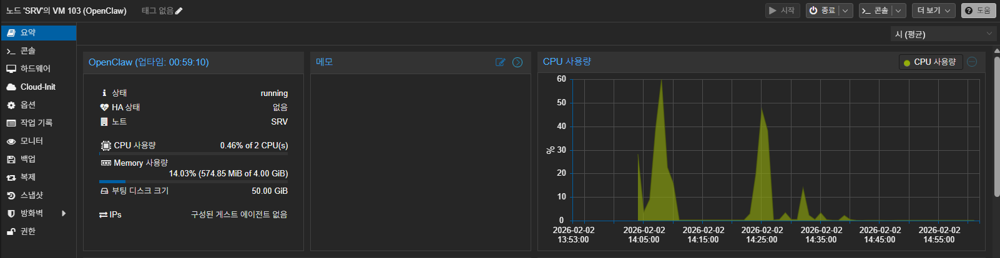

## OpenClaw가 무엇인가?
[OpanClaw Github](https://github.com/openclaw/openclaw)
원문 소개 번역본
```
OpenClaw는 사용자가 자신의 기기에서 직접 실행하는 개인 AI 어시스턴트입니다.
이미 사용 중인 채널(WhatsApp, Telegram, Slack, Discord, Google Chat, Signal, iMessage, Microsoft Teams, WebChat)에서 응답하며, BlueBubbles, Matrix, Zalo, Zalo Personal과 같은 확장 채널도 지원합니다.

또한 macOS, iOS, Android에서 음성으로 말하고 듣는 기능을 제공하고, 사용자가 제어할 수 있는 실시간 Canvas를 렌더링할 수 있습니다.
Gateway는 단순한 제어 평면(control plane)에 불과하며, 실제 제품은 이 어시스턴트 자체입니다.
```

ChatGPT의 힘을 빌려서 부족한 어휘력으로 설명을 해보자면 OpenClaw는 개인이 직접 운영하는 ‘자기 소유형 AI 어시스턴트 플랫폼’이며,
특정 메신저용 봇이 아니라, 여러 채널에서 동일한 AI 어시스턴트를 동작시키기 위한 통합 게이트웨이이자 제어 계층 서비스 라고 말할 수 있다.

Clawdbot → Moltbot을 걸쳐 현재의 OpenClaw까지의 발전으로 이제는 “메신저 봇”에서 “개인 소유 AI 어시스턴트 플랫폼”으로의 진화라고 설명할 수 있다.


### 설치를 위한 환경 구성

우선 OpenClaw를 구동할 환경을 만들어야한다.

24시간 서비스가 되어야 효과적인 활용을 할 수 있기에 집에 구성된 서버를 활용할 계획이다.


서버 구성은 다음과 같이 생성했다
| 구분 | 내용 |
|------|------|
| OS | RockyLinux 9.7 Minimal |
| CPU | 2 Core (vCPU) |
| MEM | 4GB |
| Disk | 50GB |

위와 같이 설정하고 OS 설치를 진행했다.


### 기본 설정

1. 패키지 설치

OS를 설치한 뒤 기본적인 설정과 기본 패키지 설치를 진행한다.

가장 먼저 해야될 것을 당연하게도 OS 패키지 최신화를 진행하고 기본적인 패키지를 설치한다.

```bash
dnf -y update #OS 최신화를 진행한다
dnf -y install vim net-tools bash-completion 
#vim 편집기와 ifconfig를 위한 net-tools 그리고 탭키를 통한 자동완성을 위해 bash-completion을 설치한다.
```

2. 보안 접속 설정

이제 기본적인 보안 설정을 진행한다.

우선적으로 ssh 접속 시 root 차단을 막고 ssh 포트를 변경하는 작업 부터 진행한다.

ssh 설정은 다음과 같이 진행한다.
```bash
vi /etc/ssh/sshd_config
```

위 경로에서 다음과 같은 항목을 수정한다.
```bash
Port 2222 #기존 22를 임의의 포트로 변경한다.
PermitRootLogin no #주석을 해제하고 no로 설정한다.
```

이후 firewall 설정에서 기존 ssh 서비스를 제거하고 새로 생성한 포트를 기입해준다.
```bash
firewall-cmd --permanent --zone=public --remove-service=ssh
firewall-cmd --permanent --zone=public --add-port=2222/tcp #위에 설정한 포트
firewall-cmd --reload #정책 새로고침
firewall-cmd --list-all #정책 확인
```

불필요하면 selinux도 비활성화 한다.
```bash
vi /etc/selinux/config
```

해당 파일에서 다음과 같이 수정한다
```bash
SELINUX=disabled
```

3. 계정 추가

root 계정을 비활성화 했으니 이제 서버에 접속할 유저 계정을 생성해준다.

```bash
useradd 계정명
passwd 계정명 #이후 패스워드 입력
```

추가한 계정을 wheel 그룹에 추가해준다.
```bash
usermod -aG wheel 계정명
```

이제 sudo 설정에서 wheel 그룹이 설정된 상태인지 확인한다.
```bash
visudo #해당 명령어로 sudo 설정 확인
%wheel  ALL=(ALL)       ALL #해당 항목 주석이 해제된 상태인지 확인
```

위와 같이 설정된 상태라면 준비가 끝났다.

이후 서버를 재부팅한 뒤 생성한 계정으로 ssh 접속이 가능하고 sudo로 root 접근이 가능한지 확인하면 된다.

OpenClaw 설치는 다음 포스트에 이어서...