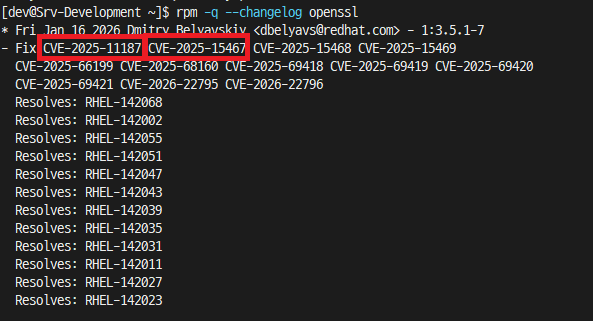

## OpenSSL 보안 취약점

26년 01월 30일 기준 KISA에서는 OpenSSL에 대한 보안취약점이 존재하여, 이에 대한 업데이트 권고 사항을 공지하였다.

[KISA 공지](https://knvd.krcert.or.kr/detailSecNo.do?IDX=6677)

취약점 코드는 CVE-2025-11187, CVE-2025-15467 두 항목으로 이에 대해 패치가 필요한 상태다.


## RHEL, RockyLinux의 보안 정책

RockyLinux는 베이스가 RHEL의 포크 버전으로, RHEL의 보안 정책을 따르고 있다.

RHEL은 백포팅 보안 정책을 따르고 있으며, 이에 대한 내용은 아래 사이트에서 찾아볼 수 있다.

※ 백포팅 이란? (출처 - RedHat Backporting Security Fixes Page)
```
"We use the term backporting to describe the action of taking a fix for a security flaw out of the most recent version of an upstream software package and applying that fix to an older version of the package we distribute."

우리는 최신 버전의 업스트림 소프트웨어 패키지에서 보안 결함을 수정하고 배포하는 이전 버전의 패키지에 해당 수정 사항을 적용하는 동작을 백포팅이라는 용어를 사용합니다.
```

[RedHat Security backporting](https://access.redhat.com/security/updates/backporting)

RedHat은 안정적인 버전을 보장하며 수정 사항이 원치 않는 부작용을 일으키는걸 방지하고 다른 변경 사항으로 부터 격리시키기 위해 이런 정책을 운영한다고 말하였다.

RockyLinux 또한 이러한 정책을 따라 백포팅 업데이트로 운영되고 있다.

[RockyLinux Security and CVE Tools](https://ciq.com/blog/rocky-linux-security-and-cve-tools/)

```
"To maintain software stability, RHEL (and therefore Rocky) take selected 'small fixes' from newer versions of software and bring them back (called a 'backport') to the version in the distro."

"소프트웨어 안정성을 유지하기 위해 RHEL(따라서 록키)은 최신 버전의 소프트웨어에서 선택한 '작은 수정'을 가져와 배포판의 버전으로 다시 가져옵니다('백포트'라고 함)."
```

## OS 내 OpenSSL 업데이트 진행

1. 버전 및 환경 확인
- 우선 OpenSSL 업데이트를 진행하기 앞서 설치된 OS의 버전과 여러 정보를 확인해야 한다.
- 다음 명령어로 OS 버전을 확인할 수 있다.
```bash
cat /etc/redhat-release
```
- 이제 현재 설치된 OpenSSH와 OpenSSL 버전을 확인해야 한다.
```bash
ssh -V 
#또는
openssl version
```

2. 업데이트 설치
2.1. 온라인 설치 진행
- 현재 서버 환경이 온라인 상태라면 dnf를 통해 패키지 업데이트를 진행한다.
- 우선 OpenSSH 부터 진행한다.
```bash
sudo dnf -y update openssh
```
- openssh 업데이트가 완료되면 OpenSSL도 진행한다.
```bash
sudo dnf -y update openssl
```
- 두 과정이 완료되면 sshd 서비스를 재구동한다.
```bash
systemctl restart sshd
```
- 이후 ssh 재접속이 정상적으로 이루어지는지 확인하고, 이전 과정에서 진행한 방법대로 OpenSSH와 OpenSSL 버전을 확인한다.

2.2. 오프라인 설치
- 일부 폐쇄망 환경에서는 rpm 파일을 사용하여 직접 오프라인 설치가 필요하다.
- 이를 글로 작성하면 내용이 길어지고 정리가 어려워, 효율적인 사용을 위해 스크립트를 작성하였다.
- [ssl_ssh_patch_script](https://github.com/HelloJamong/linux-ez-kit/tree/main/scripts/ssl_ssh_patch)
- 위 레포지토리 내 스크립트와 파일을 통해 오프라인 환경에서 자동 설치 및 서비스 검증이 가능하다.


3. 보안취약점 적용 확인
- 위와 같은 과정으로 openssh는 8.7p1 버전으로, openssl은 3.5.1 버전으로 패치가됐다.
- 근데 그러면 KISA에서 권고하는 OpenSSL 버전은 3.5.5 이상인데 잘못된게 아닐까 라는 의구심을 가지게된다.
- 위에 안내했던 내용과 같이 백포트 패치를 통해 현재 버전은 3.5.1-7 버전으로 문제가 됐던 취약점이 조치된 상태다.
- 이를 확인하기 위해서는 아래와 같은 명령어로 확인이 가능하다.
```bash
rpm -q --changelog openssl
```
- 위 명령어를 입력하면 반영된 보안취약점 리스트가 출력되고 이중 문제가 된 두 취약점을 확인할 수 있다.



보안취약점 조치 방법을 설명하면서 작성한 스크립트도 사용해줬으면 하는 의미로 포스트를 작성하였다.

혹시라도 사용해본 사람이 있다면 피드백은 언제나 환영하니 잘 부탁하는 말로 마무리를 짓고자 한다.