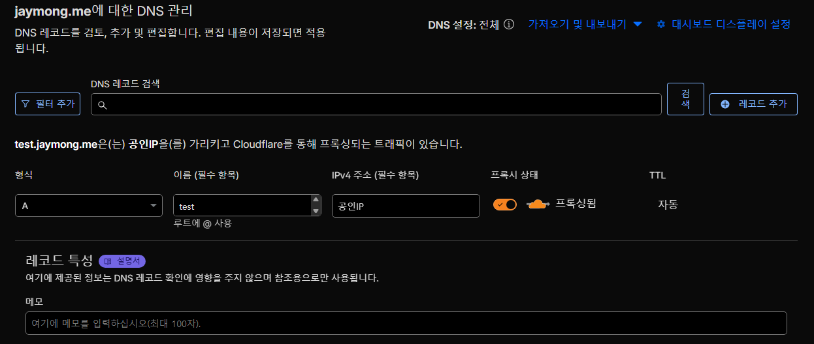
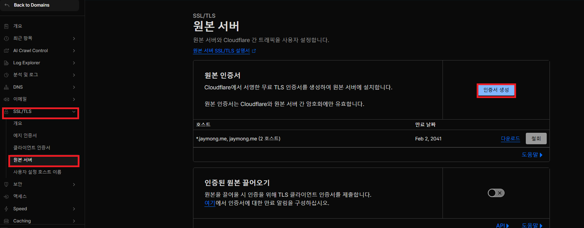

## 환경 개선이 필요했다

현재 집에는 NAS와 서버용 PC와 같은 다수의 장비가 있는 상태이며,
NAS만 무료 DNS인 duckdns.org를 통해 SSL 인증을 구성한채로 여태 사용해왔다.

이렇게 사용하다보니 문제가 NAS에서 동작 중인 여러 Docker 서비스들 만들때마다
매번 공유기에서 포트포워딩 설정과 시놀로지 DSM에서 역 프록시 설정을 해야됐다.

그뿐 아니라 서버로 운영하는 Proxmox VE의 운영 콘솔과 이외 서비스들은
시놀로지에서 잡고있는 443 포트 때문에 SSL 인증이 불가능했고, iptime 공유기의 자체 DDNS를 통해 이용해야 했다.

이러한 환경에서 최근 AI와 관련된 여러 환경을 구성하고 외부 접근 설정을 하다보니,
https 통신이 불가피하게 되었고 이를 위해 내부 환경 개선을 진행하였다.

---

## CloudeFlare 구성

이미 본 블로그 글을 보는 사람이면 예상했듯이 기존에 도메인 1개를 구매하여 사용 중이다.

메인 도메인은 유지하고, 서브 도메인을 구성해서 연결할 예정이다.

우선 가장 먼저 집안의 데이터를 담당하는 NAS와 다수의 VM 운영을 담당하는 Proxmox VE를 연결하기 위한 레코드를 설정할려고 한다.

위 첨부된 이미지처럼 서브 도메인을 등록한다.

형식은 A, 이름은 사용할 서브 도메인을 입력하고 IPv4 주소는 현재 서버가 있는 공인 IP를 설정해서 입력한다.

그리고 프록시 상태를 활성화(주황색 구름)해야 IP 노출이 발생하지 않는다.

위와 같은 형식으로 사용할 서비스의 서브 도메인을 등록한다.

---

## 인증서 발급

도메인을 구성한 후 TLS/SSL 인증을 위한 인증서를 발급해야한다.

위 첨부된 이미지와 같은 경로로 이동하여, "인증서 생성"을 진행한다.

생성된 인증서 키를 각각 origin.pem, origin.key 파일로 저장해둔다.

※ 인증서 키는 절대로 외부로 유출되지 않도록 유의해야 한다.

이 인증서는 추후 nginx 구성 시 SSL 인증을 위해 사용될 예정이다.

---

본격적인 Nginx 구성은 다음편에 계속...
