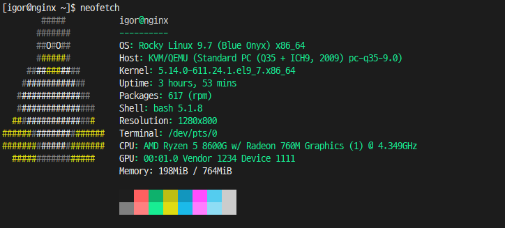
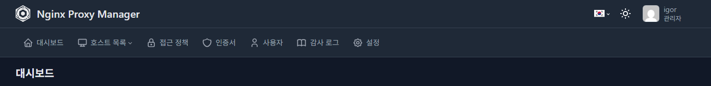

## 환경 개선이 필요했다

현재 집에는 NAS와 서버용 PC와 같은 다수의 장비가 있는 상태이며,
NAS만 무료 DNS인 duckdns.org를 통해 SSL 인증을 구성한채로 여태 사용해왔다.

이렇게 사용하다보니 문제가 NAS에서 동작 중인 여러 Docker 서비스들 만들때마다
매번 공유기에서 포트포워딩 설정과 시놀로지 DSM에서 역 프록시 설정을 해야됐다.

그뿐 아니라 서버로 운영하는 Proxmox VE의 운영 콘솔과 이외 서비스들은
시놀로지에서 잡고있는 443 포트 때문에 SSL 인증이 불가능했고, iptime 공유기의 자체 DDNS를 통해 이용해야 했다.

이러한 환경에서 최근 AI와 관련된 여러 환경을 구성하고 외부 접근 설정을 하다보니,
https 통신이 불가피하게 되었고 이를 위해 내부 환경 개선을 진행하였다.

---

## Nginx 구성

이제 본격적으로 nginx를 설치하고 구성해보자

효율적이고 편리한 관리를 위해 NPM(Nginx Proxy Manager)를 설치할 계획이다.



nginx를 설치할 VM 서버 사양이다. 

보시다시피 저사양 서버이며, 해당 서버로는 NPM과 NPM 구동을 위한 도커 컨테이너만 설치할 예정이다.

우선 Docker와 nginx 설정을 위한 방화벽 포트를 오픈한다.

```bash
sudo firewall-cmd --permanent --zone=public --add-port=443/tcp
sudo firewall-cmd --permanent --zone=public --add-port=80/tcp
sudo firewall-cmd --permanent --zone=public --add-port=81/tcp
sudo firewall-cmd --reload
```

그리고 Docker와 Docker Compose를 설치하고 동작을 확인해본다.

```bash
sudo dnf -y install dnf-plugins-core
sudo dnf config-manager --add-repo https://download.docker.com/linux/centos/docker-ce.repo
sudo dnf -y install docker-ce docker-ce-cli containerd.io docker-compose-plugin
sudo systemctl enable --now docker
```

```bash
docker version
docker compose version
```

만일 Docker Version을 실행할때 Permission 에러가 발생한다면 다음과 같이 진행한다.

```bash
sudo usermod -aG docker 계정명
newgrp docker
```

이제 저용량 서버를 위한 Docker 로그를 수정한다.
이를 서버 디스크 용량이 충분하다면 진행하지 않아도 된다.

```bash
sudo mkdir -p /etc/docker
sudo vi /etc/docker/daemon.json
```
```json
{
  "log-driver": "json-file",
  "log-opts": {
    "max-size": "10m",
    "max-file": "3"
  }
}
```
```bash
sudo systemctl restart docker
```

이제 NPM 컨테이너 설치를 위한 경로와 docker compose 파일을 작성한다.

```bash
mkdir -p ~/npm
cd ~/npm
vi docker-compose.yml
```
```yml
services:
  npm:
    image: jc21/nginx-proxy-manager:latest
    container_name: nginx-proxy-manager
    restart: unless-stopped
    ports:
      - "80:80"
      - "443:443"
      - "81:81"
    volumes:
      - ./data:/data
      - ./letsencrypt:/etc/letsencrypt
```

docker compose 파일을 작성하면 docker compose를 실행하고 구동 상태를 확인한다.

```bash
docker compose up -d
docker compose ps
```

서비스 동작이 확인되면 http://서버IP:81 주소로 NPM에 접속한다.

최초 접속 시 계정명과 이메일 그리고 패스워드를 설정해서 최초 관리자 계정을 등록한다.



위와 같이 접속이 되면 NPM 설치가 완료된 상태다.

---

본격적인 NPM 설정은 다음편에 계속...

