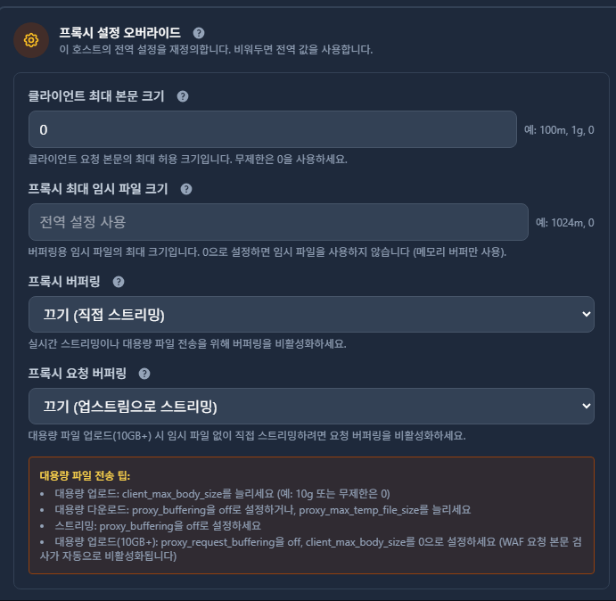

## 대체 왜 그럴까?

최근에 무료 도메인인 DuckDNS를 사용하다가 여러 시스템들의 효율적인 관리를 위해 Cloudflare에서 도메인을 구매하고 인증서 발급, 그리고 프록시 관리를 위한 Nginx 시스템을 구성했다.

기존에 iptime 도메인을 사용하던 서비스들과 공인 IP가 노출됐던 서비스, 그리고 Synology NAS를 구축한 시스템을 위해 정상적으로 이관했고 문제가 없는 줄 알았다.

그러던 어느 날 Synology의 기능인 Photos를 사용하여 모바일 기기의 이미지와 영상을 자동 백업하던 도중 100MB가 넘어가는 파일들이 지속적으로 업로드 실패가 발생하는 것을 확인했다.

혹시나 하는 마음에 Synology DSM 웹으로 대용량 파일 업로드를 시도해보니 여전히 100MB를 넘어가는 순간 **HTTP 413** 오류가 발생했다.

이는 심각한 문제라 반드시 해결해야 했고 이를 위해 부족한 지식과 AI들의 도움을 받아 문제 해결 방안을 모색하기로 했다.

---

## 현재 환경 구성

문제를 해결하기 전에 먼저 내 환경이 어떻게 구성되어 있는지 정리해봤다.

외부에서 NAS로 접근하는 경로는 아래와 같다.

```
모바일 앱/브라우저
  ↓
Cloudflare (프록시 활성화)
  ↓
iptime DDNS → 공인 IP
  ↓
Nginx Proxy Guard (NPG)
  ↓
Synology NAS
```

| 항목 | 내용 |
|---|---|
| NAS | Synology DSM |
| 도메인 | nas.jaymong.me (Cloudflare) |
| DNS | Cloudflare CNAME → iptime DDNS → 공인 IP |
| 리버스 프록시 | Nginx Proxy Guard (NPG) |
| 접속 방식 | 외부 모바일 앱 (Synology Photos) |

꽤 복잡한 구조다. 이 중 어디서 문제가 발생하는지 하나씩 확인해봐야 한다.

---

## 문제 해결 과정

### 1단계: 내부망 테스트

가장 먼저 해볼 건 역시 내부망에서 직접 접근해보는 것이다.

NAS와 같은 망에 있는 PC에서 SMB 프로토콜과 사설 IP를 통해 파일 업로드를 시도했다.

결과는? **정상적으로 100MB 이상, 심지어 1GB가 넘는 파일도 문제없이 업로드됐다.**

이로써 NAS 자체는 문제가 없다는 것을 확인했다. 그렇다면 외부 접근 경로 어딘가에 문제가 있는 것이다.

---

### 2단계: Nginx Proxy Guard 점검

다음으로 의심한 건 Nginx Proxy Guard(NPG)였다.

나는 일반 Nginx가 아닌 [Nginx Proxy Guard](https://github.com/svrforum/NginxProxyGuard)를 사용하고 있는데, 이는 Nginx에 편의성 기능을 더한 프로젝트다.

과거 GitHub 이슈를 보니 기가 단위 파일 업로드 시 문제가 있었다는 내용이 있어서 우선 최신 버전으로 패키지를 업데이트했다.

그리고 NPG 설정에서 업로드 관련 옵션들을 확인하고 변경했다:



주요 설정값들을 다음과 같이 조정했다:
- `client_max_body_size`: 0 (무제한)
- `client_body_timeout`: 적절히 증가
- `proxy_read_timeout`: 적절히 증가

하지만 **여전히 동일한 문제가 발생했다.** NPG는 문제가 아니었다.

---

### 3단계: Cloudflare가 범인이었다!

여기서 중요한 단서를 발견했다.

NPG의 access.log를 확인해보니 **대용량 파일 업로드 요청이 전혀 찍히지 않았다.** 즉, 요청이 NPG까지 도달하지도 못하고 있었던 것이다.

```bash
docker exec npg-proxy tail -f /var/log/nginx/access.log
# 업로드 시도해도 아무것도 찍히지 않음
```

그렇다면 NPG 앞단에서 차단되고 있다는 뜻인데, 그곳은 바로 **Cloudflare**다.

검색해보니 Cloudflare는 프록시 활성화 시 **Free/Pro 플랜에서 업로드 크기를 100MB로 제한**한다는 사실을 알게 됐다!

| 플랜 | 업로드 제한 |
|---|---|
| Free | 100MB |
| Pro | 100MB |
| Business | 200MB |
| Enterprise | 500MB+ |

Pro로 업그레이드해도 제한은 동일하다. 결국 대용량 파일 업로드가 필요하다면 **Cloudflare 프록시를 꺼야 한다.**

---

## 해결 방법

### Cloudflare 프록시 비활성화

Cloudflare 대시보드에 접속해서 DNS 설정으로 들어갔다.

`nas` CNAME 레코드를 찾아서 **주황색 구름(프록시 활성화) → 회색 구름(DNS만 사용)**으로 변경했다.

이렇게 하면 트래픽이 Cloudflare를 거치지 않고 공인 IP로 직접 연결된다:

```
모바일 앱/브라우저
  ↓
공인 IP (Cloudflare 우회)
  ↓
Nginx Proxy Guard
  ↓
Synology NAS
```

---

### 인증서 문제 발생!

프록시를 끄고 테스트하려는 순간, **또 다른 문제가 발생했다.**

NAS에 접속하려니 브라우저에서 "안전하지 않은 페이지"라며 접속이 차단됐다.

알고 보니 기존에 NPG에 등록된 SSL 인증서는 Cloudflare를 통해 발급받은 인증서였다. 프록시 설정을 끄니 Cloudflare 인증서를 사용할 수 없게 된 것이다.

어쩔 수 없이 NPG에 탑재된 **Let's Encrypt**를 사용하여 새로운 인증서를 발급받기로 했다.

---

### Let's Encrypt 인증서 발급

NPG는 Let's Encrypt 인증서 자동 발급 기능을 지원한다. 다만 DNS 인증 방식을 사용하려면 Cloudflare API 토큰이 필요하다.

**1. Cloudflare API 토큰 발급**

1. [dash.cloudflare.com](https://dash.cloudflare.com) 접속
2. 프로필 → API 토큰
3. **토큰 생성** → **영역 DNS 편집** 템플릿 사용
4. 영역 리소스: 포함 / 특정 영역 / `jaymong.me` 선택
5. 토큰 생성 후 복사

**2. NPG에서 인증서 발급**

NPG 관리 페이지에서:
1. SSL 인증서 → 새 인증서
2. Let's Encrypt 선택
3. 도메인: `*.jaymong.me` (와일드카드)
4. DNS 제공자: Cloudflare
5. API 토큰 입력 후 발급

발급이 완료되면 NPG가 자동으로 인증서를 갱신해준다. 더 이상 Cloudflare 인증서에 의존하지 않아도 된다!

---

## 테스트 및 결과

인증서를 적용하고 다시 NAS에 접속하니 정상적으로 HTTPS 연결이 됐다.

이제 진짜 테스트다. Synology Photos 앱에서 100MB 이상의 영상 파일을 업로드해봤다.

**정상적으로 업로드가 완료됐다!** 

1GB가 넘는 파일도 문제없이 올라간다. Cloudflare의 100MB 제한을 우회하면서도 HTTPS 보안은 Let's Encrypt로 유지할 수 있게 됐다.

---

## 마무리

이번 문제를 해결하면서 몇 가지 교훈을 얻었다.

### 배운 점

1. **Cloudflare 프록시는 만능이 아니다**: Free/Pro 플랜의 100MB 업로드 제한은 생각보다 큰 제약이다.
2. **Let's Encrypt는 강력하다**: 와일드카드 인증서를 무료로 발급받을 수 있고, 자동 갱신도 지원한다.
3. **로그를 먼저 확인하자**: NPG 로그를 확인하지 않았다면 한참을 헤맸을 것이다.

### 최종 구성

| 항목 | 변경 전 | 변경 후 |
|---|---|---|
| Cloudflare 프록시 | 활성화 (주황 구름) | 비활성화 (회색 구름) |
| 업로드 제한 | 100MB | 무제한 |
| SSL 인증서 | Cloudflare 인증서 | Let's Encrypt 와일드카드 |
| 인증서 갱신 | 수동 | NPG 자동 갱신 |

Cloudflare 프록시를 끄면서 DDoS 방어나 캐싱 같은 기능은 사용할 수 없게 됐지만, 개인용 NAS에는 큰 문제가 되지 않는다. 오히려 대용량 파일을 자유롭게 업로드할 수 있게 된 것이 훨씬 큰 이득이다.

나중에 환경을 재구성할 경우나 또는 비슷한 문제를 겪는 다른 사람들에게 도움이 됐으면 좋겠다.
